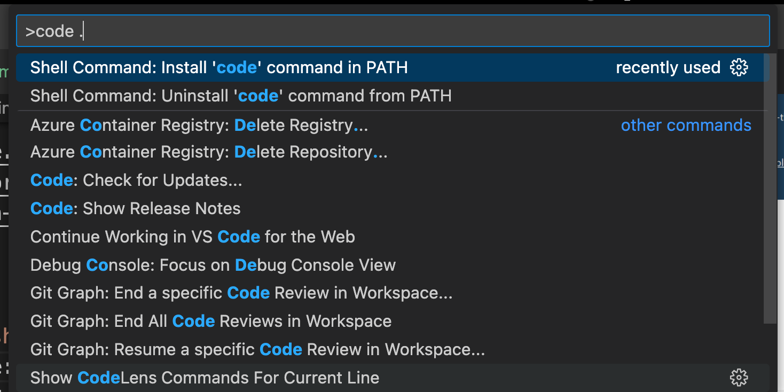

# setting-vscode-up

## only windows

1. `ctrl + shift + x`
2. type: python
3. install python extension

   

## only macOS

4. macOS: `cmmd + shift + p`
5. on the box, type: `code`
6. select: `Shell Command: Install
code command in PATH`
7. Restart your VSCode
   

## windows & macOS: python interpreter

1. macOS: `cmmd + shift + p`, windows: `ctrl + shift + p`
2. On the dropdown menu write: python
3. Click on `Python: Select interpreter`
4. Choose the `ironhack` environment if you have created it previously

## you're done!

We did this so that:

1. You can choose python environments on VSCode and make sure your libraries are available.
2. From anywhere in your terminal (git-bash, iTerm2, Terminal, etc) you can navigate your system through `cd folder` commands and then write `code . `. This will save a lot of navigation time.
